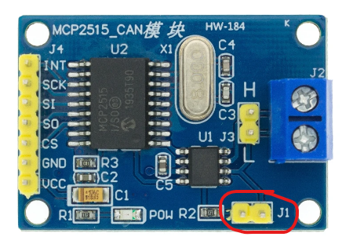

# CAN Bus

## Protocol

Le cockpit est découpés en plusieurs modules indépendent les uns des autres.
Chaque module est controlé grâce à son micro-controlleur et ne gère que sa partie.

Les modules on néanmoins besoin de communiquer entre eux et surtout avec MSFS (au travers de l'application  `A320_Cockpit.exe`).
Pour se faire, tous les modules sont connectés entre eux via le CAN Bus. Il est capable de faire transiter des messages identifiés et chaque module connait les messages dont les informations lui sont essentiel.

## Terminaison

Le bus can doit être terminé par des resistances de 120 ohm à chaque extréminté. Les composants CAN Bus utilisés (MCP2515 Can Bus Module TJA1050) permettent de terminer le BUS en shuntant les deux pins J1.

## Contenu des frames

La liste des frames et leurs contenu est définit dans ce document: [A320 - Frames](https://docs.google.com/spreadsheets/d/1uD0RiQH6JCBkLGvKdf0zEgIdWBANVKqJLpBp8rOPFtM/edit?gid=0#gid=0)