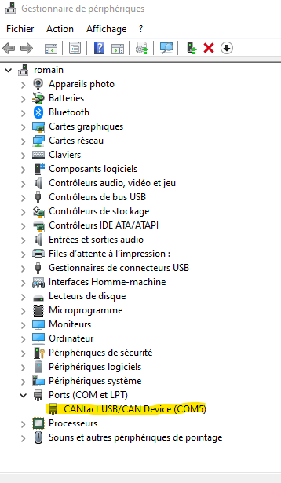

# Drivers

## CANtact

Pour communiquer avec le module CANtact (CAN bus), télécharger ce fichier zip [canable-windows-driver.zip](../_assets/install/canable-windows-driver.zip) (ou depuis le site de l'éditeur https://canable.io/), extraire son contenu et installer le grâce au clique droit sur le fichier `.inf` puis "Installer"

Vérifier dans le gestionnaire de périphérique, le module devrait être visible en tant que **Ports (COM et LPT)**.

Le COM Port doit indiquer **CANtact**. Si ce n’est pas le cas, le module n'a pas le bon firmware.

Aller sur la page du contructeur pour flasher le firmware `slcan` en suivant les instructions [https://canable.io/updater/](https://canable.io/updater/) 

## Arduino

Pour communiquer avec les cartes Arduino, télécharger ce fichier zip : [CH34x_Install_Windows_v3_4.zip](../_assets/install/CH34x_Install_Windows_v3_4.zip), extraire son et l'installer grâce au `.exe`

Les arduino seront visible dans le gestionnaire de périphérique en tant que **Ports (COM et LPT)**